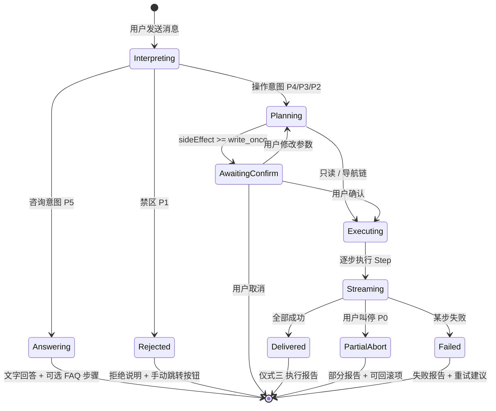

# Agent 交互仪式规格

> 状态: **v1.0** · 创建: 2026-06-21  
> 读者: 产品 / 前端（Agent 对话页 `/agent`）  
> 关联: `AGENT-COGNITIVE-MODEL.md`、`AGENT-CAPABILITIES-YAML.md`

---

## 1. 目标

为所有**有副作用或批量**的 Agent 操作定义固定「对话仪式」，使用户对 AI 代操作有**掌控感、可见性、可验收性**。  
只读查询与页面跳转走**简化仪式**（仅仪式二，跳过仪式一）。

---

## 2. 会话状态机



**前端状态字段建议**（Zustand / 会话 local state）：

```typescript
type AgentSessionPhase =
  | 'idle'
  | 'interpreting'
  | 'answering'
  | 'planning'
  | 'awaiting_confirm'
  | 'executing'
  | 'delivered'
  | 'aborted'
  | 'failed'
  | 'rejected'
```

---

## 3. 仪式一：计划公示（Plan Card）

### 3.1 何时展示

| 条件 | 展示计划卡 |
|------|-----------|
| `sideEffect === none` 或 `navigate` | **否** |
| `sideEffect === write_once` | **是** |
| `sideEffect === write_batch` | **是** + 影响范围列表 |
| `risk === forbidden` | 不进入此状态 |

### 3.2 UI 结构（Plan Card）

```
┌─────────────────────────────────────────────┐
│ 📋 执行计划                                  │
│ 我将为你完成：发布王者荣耀代练需求              │
├─────────────────────────────────────────────┤
│ ① 创建需求，标题「王者荣耀代练」              │
│ ② 设置预算 200 元                            │
│ ③ 设置有效期 3 天                            │
│ ④ 提交审核                                   │
├─────────────────────────────────────────────┤
│ [ 确认执行 ]  [ 修改参数 ]  [ 取消 ]          │
└─────────────────────────────────────────────┘
```

**组件命名建议**：`AgentPlanCard`  
**位置**：Agent 对话流中，紧挨 assistant 消息上方或作为消息块类型 `kind: 'plan'`

### 3.3 交互

| 按钮 | 行为 |
|------|------|
| 确认执行 | `phase → executing`；开始仪式二 |
| 修改参数 | 展开 inline 表单或引导用户补充一句话 |
| 取消 | `phase → idle`；可选记录「用户取消计划」 |

### 3.4 与现有批准卡的关系

- **approval accessMode** 下，写工具当前用 `AgentToolCallCard` 的「批准/拒绝」  
- **目标态**：Plan Card 先于工具调用；批准后进入 Executing，工具卡仅展示进度（不再二次批准）  
- **过渡态**（当前）：无 Plan Card 时，保留工具级批准卡

---

## 4. 仪式二：执行直播（Progress / Step Stream）

### 4.1 何时展示

**所有**涉及工具调用的路径均展示，包括只读链。

### 4.2 UI 层级

**两层进度**：

1. **Plan 级进度条**（多步时）— 顶部细条或步骤序号 `2/4`
2. **Step 级卡片** — 现有 `AgentToolCallCard` 步骤时间线

```
┌─ 执行中 2/4 ─────────────────────────────────┐
│ ▓▓▓▓▓▓▓▓░░░░░░░░░░ 50%                        │
└───────────────────────────────────────────────┘

┌ 搜索需求                          ✅ 完成 ────┐
│ 1. 正在搜索公开需求：PPT                        │
│ 2. 找到 1 个相关需求：品牌VI设计全套             │
└───────────────────────────────────────────────┘

┌ 页面跳转                          ⏳ 执行中 ───┐
│ 1. 正在打开 /demands/abc-123                  │
└───────────────────────────────────────────────┘
```

### 4.3 SSE 事件映射

| 事件 | UI 行为 |
|------|---------|
| `tool_call` | 新增 Step 卡，status running |
| `tool_step` | 追加 numbered 步骤文案 |
| `tool_result` | 更新卡 status done/failed |
| `tool_pending` | 显示待批准（过渡态） |
| `navigate` | 触发路由跳转 + 卡上「前往页面」 |
| `text` delta 中 `> ...` | 可选同步到步骤区（已有） |

### 4.4 用户叫停（P0）

执行中展示常驻按钮：**[ 停止 ]**

点击后：

- 中断后续 Step（abort SSE / 取消 pending 工具）
- 进入 `PartialAbort` → 部分 ExecutionReport

---

## 5. 仪式三：交付验收（Execution Report Card）

### 5.1 何时展示

Plan 内所有 Step 终态（done / failed / skipped）后，或只读链完成后。

### 5.2 UI 结构（Report Card）

```
┌─────────────────────────────────────────────┐
│ ✅ 全部完成                                   │
├─────────────────────────────────────────────┤
│ 📋 执行摘要                                   │
│ 需求 #12345 已创建并提交审核。                 │
├─────────────────────────────────────────────┤
│ 🔍 验收                                       │
│ [ 查看需求详情 ]  → /demands/12345            │
├─────────────────────────────────────────────┤
│ ↩️ 如需撤销                                   │
│ 审核通过前，可说「撤回需求 #12345」             │
│ 或前往 设置 → 操作日志                         │
└─────────────────────────────────────────────┘
```

**组件命名建议**：`AgentExecutionReportCard`  
**数据来源**：`03-agent-capabilities.yaml` → `delivery` 模板 + 运行时 params 替换

### 5.3 三要素强制

| 要素 | 必填 | 缺失时 |
|------|------|--------|
| 执行摘要 | 是 | 不允许结束会话轮次 |
| 验收路径 | 写操作 / 导航链 | 至少提供 link；禁止纯文字「已打开」 |
| 回滚方式 | 写操作 | 无 rollback 的 capability 须在 03 中标注 |

### 5.4 只读链简化报告

搜索+打开类场景：

```
📋 已找到 1 条 PPT 相关需求，并打开详情页。
🔍 [ 查看需求详情 ]
```

---

## 6. 批量操作专项 UI

在 Plan Card 与 Report 之间插入 **Scope Card**：

```
┌─────────────────────────────────────────────┐
│ 📦 将影响 5 个需求                            │
│ ① #1001 王者代练 — 冻结：超时未处理           │
│ ② #1002 设计LOGO — 冻结：无人接单             │
│ ...                                         │
│ ⚠️ 此操作不可逆。单次最多 20 条。              │
│ [ 确认全部 ]  [ 选择部分 ]  [ 取消 ]          │
└─────────────────────────────────────────────┘
```

**确认全部**：用户必须点击按钮或发送字面「确认全部」（防误触）。

---

## 7. 自动化任务专项 UI（Phase 4 预留）

**Task Draft Card**：

```
📋 任务名称：每日王者需求筛选
⏰ 每天 09:00
🎯 标签含「王者荣耀」，24 小时内发布
📤 结果推送至消息中心
[ 确认创建 ]  [ 修改条件 ]  [ 取消 ]
```

任务列表页：`/agent/tasks`（路由待建）。

---

## 8. 安全与信任 UI

### 8.1 三重确认表现

| 风险 | 仪式一 | 仪式二 | 仪式三 | 额外 |
|------|--------|--------|--------|------|
| low | 计划公示 | 直播 | 报告 + 链接 | — |
| medium | 计划 + 确认按钮 | 直播 | 报告 + 回滚提示 | — |
| high | 计划 + 范围 + 确认全部 | 直播 | 报告 + 通知 | 操作日志 |
| forbidden | 拒绝卡 | — | — | 跳转手动页 |

### 8.2 禁区拒绝卡

```
┌─────────────────────────────────────────────┐
│ 🚫 无法代你完成此操作                         │
│ 支付涉及资金安全，请在订单页手动完成。         │
│ [ 前往支付页 ]                                │
└─────────────────────────────────────────────┘
```

---

## 9. 与 AgentChat 现有组件映射

| 仪式 | 现有 | 待建 |
|------|------|------|
| 计划公示 | — | `AgentPlanCard` |
| 执行直播 | `AgentToolCallCard` + tool_step | `AgentPlanProgress` |
| 交付验收 | 部分（navigate 按钮） | `AgentExecutionReportCard` |
| 批量范围 | — | `AgentScopeCard` |
| 拒绝 | toast / 文字 | `AgentForbiddenCard` |

**样式**：复用 `agent-codex-tool-card`、`agent-codex-tool-approval` 类，保持 `/agent` Codex 视觉一致。

---

## 10. 验收标准（UI DoD）

1. 「搜并打开第一个」：无 Plan 卡，有 2 张 Step 卡 + navigate + Report 含链接  
2. 「发需求」：有 Plan 卡 → 确认 → 直播 → Report 含 `/demands/:id`  
3. 写操作未执行前，assistant 不得出现「已创建/已打开」  
4. 刷新对话后，pending 批准与 Report 链接仍可见（持久化）  
5. 用户点「停止」后，已完成步骤可点击验收，未完成步骤标 skipped  

---

## 11. 参考

- 设计原则六条：见 `AGENT-COGNITIVE-MODEL.md` §2  
- Capability delivery 模板：见 `AGENT-CAPABILITIES-YAML.md`  
- 实现入口：`client-react/src/views/AgentChat.tsx`
